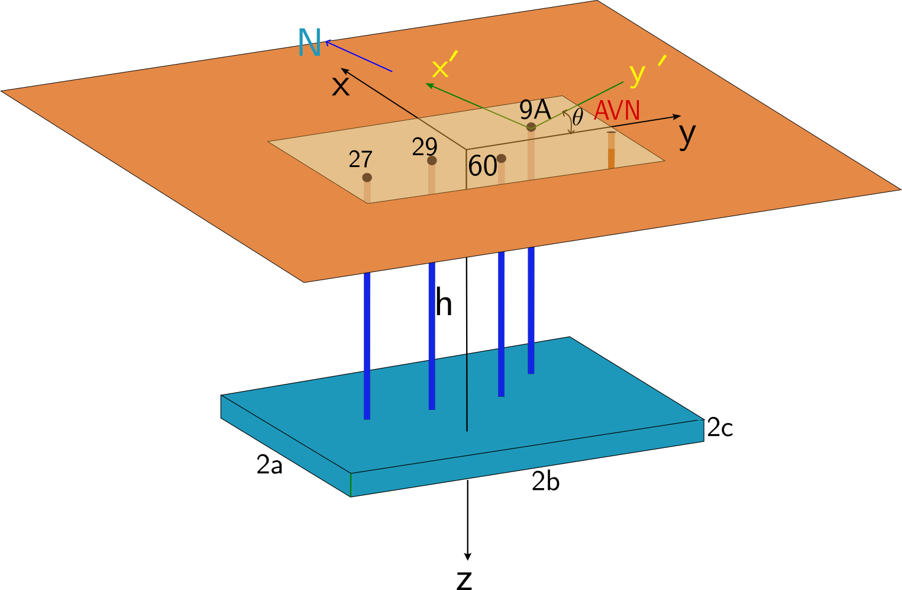

# AVANT Multi-Station Poroelastic Strain Modeling and Bayesian Inversion

A Python implementation of an analytical solution for deformation and strain induced by pore-pressure changes within a subsurface inclusion embedded in an elastic half-space, together with a production workflow for Bayesian parameter inference, uncertainty quantification, sensitivity analysis, and optimal experimental design (OED).

<p align="center">
  
</p>

The analytical model combines **Eshelby's eigenstrain formulation** with **Mindlin half-space solutions** and the corresponding **Chen equations** to calculate three-dimensional displacement and strain resulting from a pressurized subsurface inclusion.

The formulation provides a computationally efficient alternative to fully numerical poroelastic models and is designed for forward modeling, comparison with numerical or field strain observations, Bayesian inversion, sensitivity analysis, uncertainty quantification, and strainmeter-network design.

The production workflow currently compares the analytical model with the canonical AVANT 1-Darcy COMSOL dataset and uses the resulting model-data relationship to infer uncertain inclusion geometry and location, quantify uncertainty and model discrepancy, and determine informative strainmeter configurations.

---

## Analytical Model

A pore-pressure perturbation within the subsurface inclusion produces a poroelastic eigenstrain. Eshelby's inclusion theory describes the resulting deformation in an infinite elastic medium, while the Mindlin–Chen formulation accounts for the presence of the traction-free surface.

The inclusion geometry is characterized by the semi-dimensions

\[
a,\qquad b,\qquad c,
\]

its depth parameter

\[
h,
\]

its horizontal orientation

\[
\theta,
\]

and its center coordinates

\[
(x_0',y_0').
\]

The analytical implementation predicts components of the three-dimensional displacement and strain tensors at arbitrary observation locations. The current AVANT production workflow compares the modeled strain tensor with multi-station observations using

\[
\epsilon_{xx},\qquad
\epsilon_{yy},\qquad
\epsilon_{zz},\qquad
\epsilon_{xy}.
\]

For the current 1-Darcy Bayesian inversion, the vertical semi-dimension \(c\) and elastic/pressure-model properties are fixed, while six geometric/location parameters are inferred:

\[
\boxed{
[a,\ b,\ h,\ \theta_{\mathrm{deg}},\ x_0',\ y_0']
}
\]

together with the statistical nuisance parameter

\[
\log_{10}\sigma_{\mathrm{strain}}.
\]

The physical residual scale is

\[
\sigma_{\mathrm{strain}}
=
10^{\log_{10}\sigma_{\mathrm{strain}}},
\]

and represents an effective combination of observation uncertainty, unresolved variability, and analytical-model/data discrepancy.

---

## Production Workflow

The repository connects the analytical solution to a complete inference and experimental-design workflow:

```text
             Canonical AVANT 1-Darcy data
                         |
                         v
               Analytical forward model
                         |
                         v
                 Bayesian inversion
                         |
                         v
              Posterior uncertainty
                    /          \
                   /            \
                  v              v
       Sensitivity analysis    Posterior UQ
                  \              /
                   \            /
                    v          v
               Experimental design
                         |
              +----------+----------+
              |                     |
              v                     v
       Classical / robust      Bayesian OED
          Fisher OED                |
                                    v
                        Expected Information Gain
                                  (EIG)
```

The workflow addresses three related scientific questions:

1. **Inference:** What inclusion geometry, orientation, depth, and location are consistent with the observed strain response?
2. **Uncertainty:** How well are those parameters constrained, and how much model-data discrepancy remains?
3. **Experimental design:** Where should strainmeters be placed, or which existing stations should be retained, to obtain the greatest information about an inclusion whose geometry and boundaries may initially be uncertain?

The OED framework therefore supports both **pre-inversion design under uncertain geometry** and **posterior-informed design after Bayesian inference**.

---

The complete MCMC state is therefore

\[
\theta =
[a,\ b,\ h,\ \theta_{\mathrm{deg}},\ x_0',\ y_0',
\log_{10}\sigma_{\mathrm{strain}}].
\]

Here, `sigma_strain` represents the effective residual strain-error scale and can account for measurement uncertainty, unresolved variability, and discrepancy between the analytical model and the reference dataset.

---

## Canonical 1-Darcy Dataset

The production workflow uses the canonical eight-station transient dataset:

```text
datasets/comsol/1darcy/
├── metadata/
│   └── stations.csv
├── processed/
│   └── strain.csv
└── raw/
    └── ...
```

The processed data contract is:

- 8 stations: `S01` through `S08`
- 107 time steps
- 4 strain components per station
- 32 strain channels
- 3424 strain observations

The strain components are

\[
\epsilon_{xx},\quad
\epsilon_{yy},\quad
\epsilon_{zz},\quad
\epsilon_{xy}.
\]

The production Bayesian likelihood uses a consistent component-major flattening convention for observed and predicted strain vectors.

---

## Repository Structure

```text
Avant_multi_station/
│
├── README.md
├── pyproject.toml
├── .gitignore
│
├── assets/
│
├── datasets/
│   └── comsol/
│       └── 1darcy/
│
├── src/
│   └── avant_model/
│       ├── data/
│       ├── model/
│       ├── inversion/
│       └── oed/
│
├── scripts/
│   ├── preprocessing/
│   ├── inversion/
│   ├── postprocessing/
│   ├── sensitivity/
│   └── oed/
│
├── tests/
│
└── docs/
```

### Core package

`src/avant_model/model/`

Contains the analytical multi-station strain model, coordinate transformations, strain calculations, and tensor rotation utilities.

`src/avant_model/inversion/`

Contains the reusable Bayesian likelihood and parameter-handling functions.

`src/avant_model/oed/`

Contains Fisher-information calculations, design metrics, geometry uncertainty, robust OED, sensor placement, and Bayesian design utilities.

### Production runners

```text
scripts/preprocessing/clean_dataset.py

scripts/inversion/run_inversion_multi_station.py

scripts/postprocessing/postprocess_bayesian_1darcy.py

scripts/sensitivity/run_sensitivity_1darcy.py

scripts/oed/run_oed_1darcy.py

scripts/oed/run_bayesian_oed_1darcy.py
```

These scripts form the supported production command-line workflow.

---

## Installation

Python 3.9 or newer is required.

Create and activate an environment containing the required scientific Python packages, then install the repository in editable mode.

```bash
python -m pip install -e .
```

For Bayesian inversion:

```bash
python -m pip install -e ".[inversion]"
```

For sensitivity analysis:

```bash
python -m pip install -e ".[sensitivity]"
```

For plotting utilities:

```bash
python -m pip install -e ".[plotting]"
```

For development and testing:

```bash
python -m pip install -e ".[test]"
```

The principal dependencies are NumPy, pandas, SciPy, Matplotlib, PyDREAM, SALib, and pytest.

---

## Quick Start

Commands below assume they are executed from the repository root.

### 1. Validate or preprocess the dataset

Inspect the preprocessing interface with:

```bash
python scripts/preprocessing/clean_dataset.py --help
```

The production analytical workflow expects:

```text
datasets/comsol/1darcy/metadata/stations.csv
datasets/comsol/1darcy/processed/strain.csv
```

---

### 2. Run Bayesian inversion

Inspect available controls:

```bash
python scripts/inversion/run_inversion_multi_station.py --help
```

A short software smoke test can be run with:

```bash
python scripts/inversion/run_inversion_multi_station.py \
    --max-iter 20 \
    --batch-size 20 \
    --nchains 4
```

This is **not** a scientifically converged inversion. It is only intended to verify the computational workflow.

Production inference must use sufficient iterations and must satisfy the configured convergence criterion.

The default output hierarchy is:

```text
results/bayesian/1darcy/<model-name>/
```

Typical outputs include:

```text
run_manifest.json
posterior_run_summary.json
convergence_history.csv
chain samples
log-probability arrays
```

---

### 3. Postprocess the Bayesian posterior

```bash
python scripts/postprocessing/postprocess_bayesian_1darcy.py \
    --run-dir results/bayesian/1darcy/<model-name>
```

The postprocessor produces publication-quality posterior and predictive diagnostics, including:

- parameter trace plots
- posterior marginal distributions
- posterior mean, median, MAP, and credible intervals
- posterior correlation diagnostics
- pairwise posterior relationships
- station-by-station observed-versus-predicted strain
- parameter-only predictive uncertainty
- total predictive uncertainty
- residual diagnostics
- quantitative posterior-predictive metrics

The posterior parameter-distribution figure reports the physical residual scale

\[
\sigma_{\mathrm{strain}}
=
10^{\log_{10}\sigma_{\mathrm{strain}}}
\]

rather than only its logarithmic MCMC representation.

---

### 4. Run sensitivity analysis

Inspect the available controls:

```bash
python scripts/sensitivity/run_sensitivity_1darcy.py --help
```

The sensitivity workflow supports complementary analyses including:

- one-at-a-time parameter sweeps
- two-dimensional response surfaces
- global parameter sampling
- Sobol sensitivity analysis

The primary physical sensitivity parameters are:

\[
[a,\ b,\ h,\ \theta_{\mathrm{deg}},\ x_0',\ y_0'].
\]

---

### 5. Run classical and robust OED

For local Fisher-information analysis:

```bash
python scripts/oed/run_oed_1darcy.py --mode local
```

The canonical eight-station reference configuration has been regression-tested to produce a full-rank six-parameter Fisher system.

Additional OED modes support:

- existing-station subset analysis
- prior-domain robust design
- geometry-boundary stress testing
- free spatial sensor placement

Inspect all modes with:

```bash
python scripts/oed/run_oed_1darcy.py --help
```

---

### 6. Run posterior-informed Bayesian OED

First validate a completed Bayesian run:

```bash
python scripts/oed/run_bayesian_oed_1darcy.py \
    --run-dir results/bayesian/1darcy/<model-name> \
    --mode validate
```

Posterior-informed design analyses include:

```text
posterior_existing
posterior_placement
eig
```

For example:

```bash
python scripts/oed/run_bayesian_oed_1darcy.py \
    --run-dir results/bayesian/1darcy/<model-name> \
    --mode posterior_existing
```

Bayesian OED should normally be performed only with a converged posterior.

The `--allow-nonconverged` option exists for software testing and diagnostic work. It should not be used to justify production scientific conclusions.

---

## Optimal Experimental Design

The repository implements several complementary experimental-design strategies.

### Local Fisher OED

Local OED uses the model Jacobian

\[
J = \frac{\partial f}{\partial\theta}
\]

to construct a Fisher information matrix

\[
F = J^T W J,
\]

where \(W\) represents observation weighting.

This provides local measures of parameter identifiability and experimental information.

### Robust OED

Because the true inclusion size, shape, orientation, depth, and center may be uncertain before deployment, robust OED evaluates candidate sensor networks across multiple plausible geometry scenarios.

These scenarios may be generated from:

- prior-domain Latin hypercube sampling
- random prior sampling
- deterministic parameter-boundary cases
- posterior geometry samples

Candidate designs can then be ranked using expected, conservative, worst-case, and stability-aware criteria.

### Bayesian OED

After Bayesian inversion, posterior samples can be used directly as geometry scenarios.

This allows experimental design to account for the uncertainty remaining after observing the current data.

### Expected Information Gain

Expected Information Gain (EIG) asks:

> Which proposed sensor configuration is expected to reduce uncertainty about the unknown inclusion parameters the most?

Conceptually,

\[
\mathrm{EIG}(d)
=
\mathbb{E}
\left[
D_{\mathrm{KL}}
\left(
p(\theta\mid y,d)
\parallel
p(\theta)
\right)
\right].
\]

Larger EIG indicates a design expected to provide more information about the uncertain parameters.

---

## Convergence and Scientific Use

A short MCMC run can verify that the computational pipeline works, but it does not establish a scientifically meaningful posterior.

Production Bayesian results should not be interpreted until convergence diagnostics are satisfactory.

The production inversion runner records convergence information in its output directory.

A run marked:

```text
not_converged
```

must be treated as diagnostic only.

Posterior summaries, uncertainty intervals, posterior-informed OED, and EIG calculations based on a non-converged run are useful for software validation but should not be reported as final scientific inference.

---

## Testing

The repository includes a deterministic regression suite covering:

- canonical dataset structure
- analytical forward-model behavior
- strain tensor rotation invariants
- Bayesian parameter and likelihood contracts
- Fisher-information calculations
- geometry uncertainty
- robust design metrics
- sensor placement
- Bayesian OED utilities

Run:

```bash
python -m pytest -q
```

The current release baseline contains **60 regression tests**.

The normal test suite intentionally avoids expensive production MCMC, global sensitivity, and full Monte Carlo OED calculations.

---

## Generated Outputs

Generated analysis products are intentionally excluded from version control.

This includes:

```text
results/
plots/
logs/
checkpoints/
```

as well as large numerical arrays and sampler state.

Curated documentation figures may be placed under:

```text
assets/
```

and committed intentionally.

Historical research-development scripts and results are maintained locally under `archive/` but are not part of the public production source tree.

---

## Reproducibility

Production runs should preserve:

- the Git commit used for the analysis
- Bayesian run manifest
- prior bounds
- fixed analytical-model parameters
- random seeds
- station metadata
- observed strain dataset
- convergence diagnostics
- software/environment information
- analysis command and configuration

See:

```text
docs/reproducibility.md
```

for the complete reproducibility contract.

---

## Documentation

Detailed documentation is provided in:

```text
docs/workflow.md
docs/bayesian_inversion.md
docs/sensitivity_analysis.md
docs/optimal_experimental_design.md
docs/reproducibility.md
docs/palmetto.md
```

These documents describe the scientific assumptions, production workflow, uncertainty treatment, experimental-design methodology, output interpretation, and HPC deployment.

---

## Palmetto HPC

Large Bayesian inversion, sensitivity, and Bayesian OED calculations are intended to be deployed on Clemson University's Palmetto cluster after local validation.

The production sequence is:

```text
Bayesian inversion
        |
        v
Convergence verification
        |
        v
Bayesian postprocessing
        |
        v
Sensitivity analysis
        |
        v
Classical / robust OED
        |
        v
Posterior-informed Bayesian OED
        |
        v
High-resolution EIG
```

See:

```text
docs/palmetto.md
```

for environment setup, SLURM configuration, recommended production execution, and output management.

---

## Development Status

The repository has been refactored from a research-development codebase into a package-oriented production workflow.

The current production architecture includes:

- canonical eight-station 1-Darcy data contract
- analytical multi-station forward model
- six-parameter physical Bayesian inversion
- explicit residual/model-discrepancy uncertainty
- posterior uncertainty quantification
- global sensitivity analysis
- local and robust Fisher OED
- free spatial strainmeter placement
- posterior-informed Bayesian OED
- Expected Information Gain
- deterministic regression testing

Legacy exploratory scripts are intentionally excluded from the public production tree.

---

## Citation

If this software is used in a publication, please cite the associated AVANT analytical strain modeling and inversion work.

A formal software/publication citation will be added when the corresponding publication and repository release information are finalized.

---

## License

A project license should be added before formal public release if one has not already been selected.